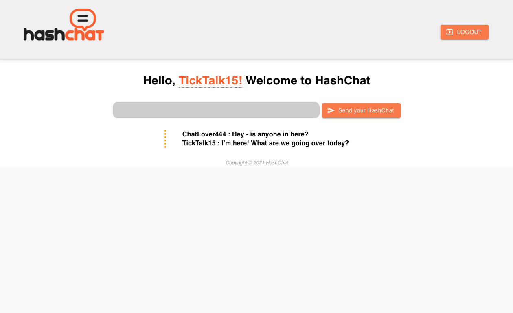

# HashChat - SEI 503 P4

<!--  -->

### HashChat is a real-time chatroom style communication platform that can be used to bring groups together. 

 

Currently hosted at Netlify: <a href="https://6100bd25a9026c264d13c25d--keen-ptolemy-d6c15f.netlify.app/">https://6100bd25a9026c264d13c25d--keen-ptolemy-d6c15f.netlify.app/</a>

 

* React - featuring useRealtime for real time chat functionality
* Supabase.io - postgREST-ful APIs
* Material UI & CSS
* Netlify

 

